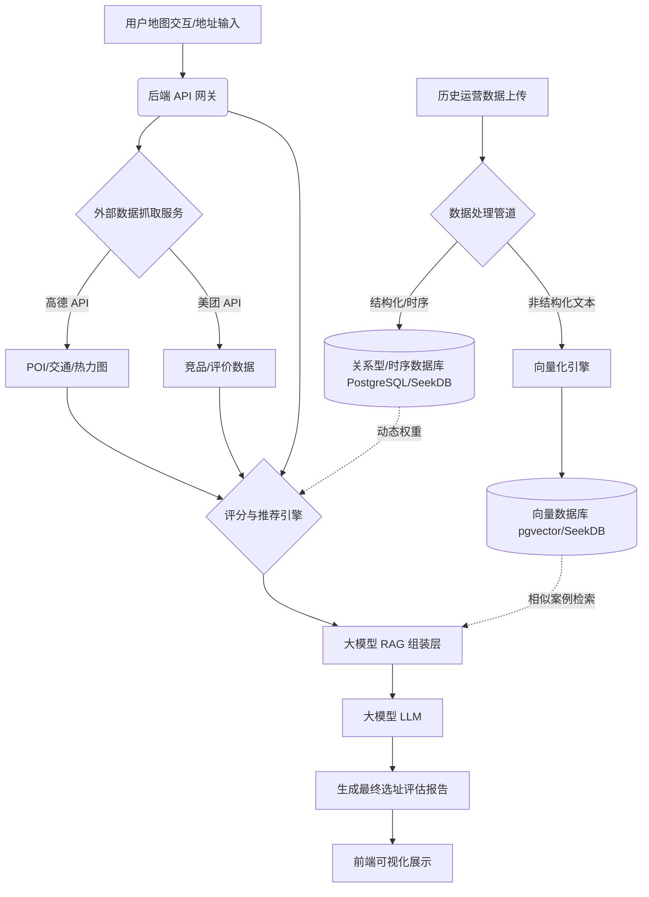

# 电竞馆智能选址系统 - 完整功能规划 (Functional Master Plan)

本文档旨在从全局视角，脱离原有参考仓库的约束，重新梳理并规划“电竞馆智能选址系统”的完整功能蓝图。该规划将作为后续详细开发计划的基石。

---

## 1. 核心业务价值
系统致力于为电竞馆投资者、连锁品牌拓展团队提供**数据驱动**的选址决策支持。通过融合外部地理商业数据（高德、美团）、内部历史运营数据，结合大模型推理与向量检索技术，实现从“宏观商圈洞察”到“微观单店评估”的全链路智能化。

---

## 2. 全局系统架构与配置体系 (System Architecture & Configurations)

系统采用高度解耦的模块化设计，核心能力均提供灵活的配置接口，以适应私有化部署和技术演进。

### 2.1 基础设施配置层 (Infrastructure Config)
*   **数据库适配器 (Database Adapter)**：支持通过配置切换底层数据引擎。
    *   方案A：`PostgreSQL + PostGIS + pgvector` (默认推荐，生态成熟)。
    *   方案B：`SeekDB` (混合数据库，统一处理关系、向量、时序数据)。
*   **大模型网关 (LLM Gateway)**：
    *   支持本地推理引擎（Ollama, vLLM，适用于私有化部署）。
    *   支持主流 API（OpenAI, 阿里云百炼, 智谱等）。
*   **向量化引擎 (Embedding Engine)**：
    *   本地模型（如 `sentence-transformers`）。
    *   API 模型（如 OpenAI Embeddings）。
*   **外部数据集成 (External Data Connectors)**：
    *   高德地图 API 密钥池（用于 POI、热力图、路径规划）。
    *   美团 API/爬虫接口（用于竞品数据、消费评价）。

---

## 3. 核心功能模块规划 (Core Modules)

系统由以下五大核心模块构成：

### 3.1 模块一：地图交互与可视化空间 (Map Interactive Workspace)
这是用户的主要操作界面，提供直观的空间感知能力。
*   **底图展示与图层控制**：集成高德地图，支持切换标准地图、卫星图。支持叠加人口热力图、交通路网图层。
*   **空间框选工具**：支持矩形框选、多边形自定义绘制、圆形半径（如 3km 商圈）绘制。
*   **连锁门店网络拓扑**：在地图上直观标记自有品牌已营业门店，并显示其“保护辐射圈”（避免内部竞争）。
*   **竞品分布雷达**：可视化展示指定区域内的同类电竞馆、网吧位置及规模。

### 3.2 模块二：智能区域推荐引擎 (Smart Area Recommendation)
针对“想在这个大区域开店，但不知道具体位置”的场景。
*   **网格化评估**：将用户框选的宏观区域划分为微小网格（如 500m x 500m）。
*   **多维数据融合**：自动抓取每个网格内的交通便利度（地铁/公交距离）、目标客群密度（高校/写字楼/小区）、竞品密度。
*   **推荐热点生成**：系统基于算法计算出网格得分，在地图上生成推荐热力区，并提取出 Top 3 推荐开店坐标点。
*   **连锁规避逻辑**：在推荐算法中引入惩罚机制，若候选点位于自有门店辐射圈内，则大幅降低评分。

### 3.3 模块三：单点精准评估与大模型报告 (Single Site Precision Evaluation & LLM Report)
针对“已经看中一个商铺，需要评估其可行性”的场景。
*   **地址解析与落点**：用户输入详细地址或在地图上点击，系统自动解析经纬度。
*   **六大维度雷达图评分**：
    1.  **市场需求**（周边人口、高校、年轻群体画像）
    2.  **地理位置**（交通枢纽距离、商圈成熟度）
    3.  **竞争环境**（3公里内竞品数量、最近竞品距离）
    4.  **运营经济性**（预估租金、面积坪效）
    5.  **合规性预警**（距离中小学距离红线等政策限制）
    6.  **技术硬件条件**（宽带接入能力等）
*   **大模型智能报告生成**：
    *   系统将上述六大维度的结构化数据，转化为自然语言 Prompt。
    *   调用配置好的 LLM，生成包含“选址优劣势分析”、“客群画像描述”、“经营建议”的完整易读的《智能选址评估报告》。

### 3.4 模块四：历史数据沉淀与 RAG 增强 (Historical Data & RAG Enhancement)
让系统具备“学习”能力，越来越懂品牌的选址逻辑。
*   **多格式数据导入**：支持上传 Excel、CSV 格式的门店历史运营报表（包含门店坐标、面积、机器数、月营收、净利润等）。
*   **非结构化经验入库**：支持上传店长总结、市场调研报告等文本，通过向量模型转化为 Embedding 存入向量数据库。
*   **动态权重调整 (锦上添花)**：基于上传的结构化运营数据，分析“成功门店”和“失败门店”的共性特征，动态微调评分引擎中各维度的权重（例如发现某品牌成功店都靠近地铁，则提高地铁距离权重）。
*   **RAG 经验检索**：在 LLM 生成评估报告时，通过向量检索，自动调取历史经验中相似的案例（如“该地址特征与之前失败的 A 门店高度相似，需注意…”），作为上下文喂给大模型，增强报告的针对性。

### 3.5 模块五：系统管理与配置后台 (System Admin & Configuration)
*   **用户登录与鉴权**：作为 B/S 架构系统，提供完整的用户注册、登录（用户名/密码或手机验证码）机制，基于 JWT (JSON Web Token) 进行会话管理。
*   **多租户/项目管理**：支持不同品牌或项目的数据隔离，不同用户登录后只能看到自己所属租户的门店数据和评估记录。
*   **接口配置面板**：提供图形化界面，用于配置数据库连接字符串、高德/美团 API Key、大模型 API 参数。
*   **模型切换开关**：一键切换本地大模型与云端大模型，切换本地向量与云端向量。
*   **自定义评分规则库**：允许高级用户手动调整六大维度的计算公式和阈值（如修改“竞品距离安全线”从 500 米调整为 800 米）。

---

## 4. 数据流转架构简图 (Data Flow Architecture)

---

## 5. 部署与交付标准 (Deployment & Delivery)

系统采用标准的 **B/S (Browser/Server) 架构**，全面支持在 **Linux 环境下的原生部署**（非 Docker）。

*   **B/S 架构设计**：
    *   **客户端 (Browser)**：用户无需安装任何软件，通过现代浏览器（Chrome, Edge 等）访问系统。前端基于 Vue/React 构建，提供丰富的地图交互体验。
    *   **服务端 (Server)**：部署在 Linux 服务器上，负责处理业务逻辑、大模型推理、数据库读写以及外部 API 调用。
*   **Linux 原生部署 (Native Deployment)**：
    *   提供完整的 Linux 环境安装脚本与指南（支持 Ubuntu/CentOS 等主流发行版）。
    *   **Web 服务器**：使用 Nginx 作为反向代理和静态资源服务器。
    *   **应用服务**：通过 Systemd 或 Supervisor 管理后端 Python (FastAPI) 进程（如 Uvicorn/Gunicorn），确保进程守护和开机自启。
    *   **数据库服务**：直接在 Linux 上安装并配置 PostgreSQL + PostGIS + pgvector（或 SeekDB），通过系统服务管理。
*   **开箱即用脚本**：提供一键环境配置脚本（Shell Script），自动完成系统依赖安装、Python 虚拟环境创建、数据库建表及默认规则写入。
